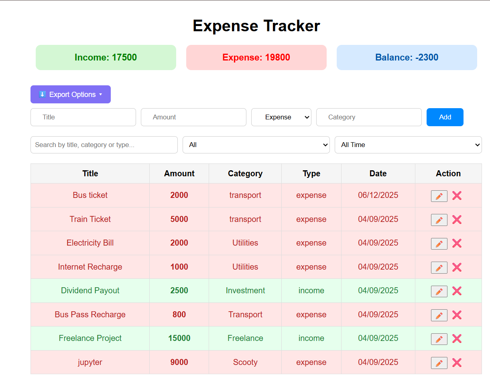
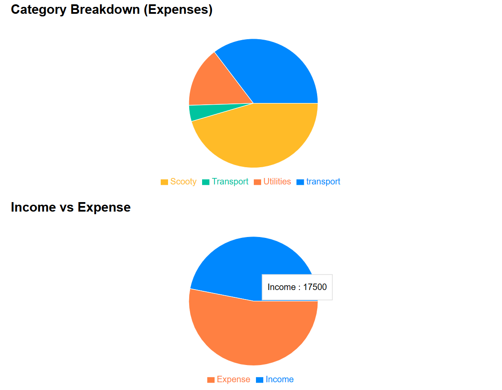
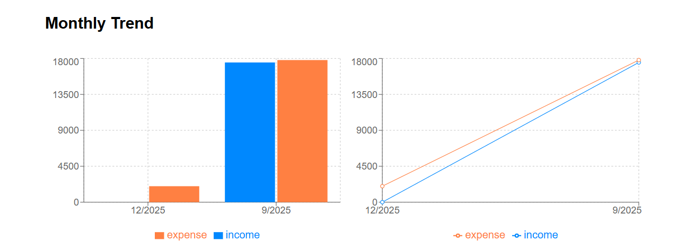

# Expense Tracker (MERN Stack)

A full-stack Expense Tracker application built using the MERN stack for managing income and expenses with real-time calculations and data visualization.

---

## Features
- Add and delete income & expense transactions
- Category-based expense tracking
- Automatic balance calculation
- Search and filter by type and date
- Interactive charts (Pie, Bar, Line)
- Export data as CSV & PDF
- Clean and responsive UI

---
## Screenshots

### Dashboard


### Charts & Analytics



---
## Tech Stack
**Frontend:** React.js, Axios, Recharts, CSS  
**Backend:** Node.js, Express.js  
**Database:** MongoDB (Atlas)

---

## Project Structure
```plaintext
expense-tracker
│
├── backend
│ ├── server.js
│ ├── package.json
│ └── .env
│
├── frontend
│ ├── src
│ │ ├── App.js
│ │ ├── api.js
│ │ ├── index.js
│ │ ├── App.css
│ │ └── components
│ ├── public
│ └── package.json
│
└── README.md
```

---

## Environment Variables
Create `.env` in backend:
PORT=5000
MONGO_URI=your_mongodb_url


---

## Run Locally
```bash

cd expense-tracker

Backend:
cd backend
npm install
npm start

Frontend:
cd frontend
npm install
npm start
```

---

## API Endpoints
- GET `/api/transactions`
- POST `/api/transactions`
- PUT `/api/transactions/:id`
- DELETE `/api/transactions/:id`

---

## Author
**Shreya V K**  
GitHub: https://github.com/Shreyavk28  
LinkedIn: https://www.linkedin.com/in/shreya-vk-fullstack-developer  


